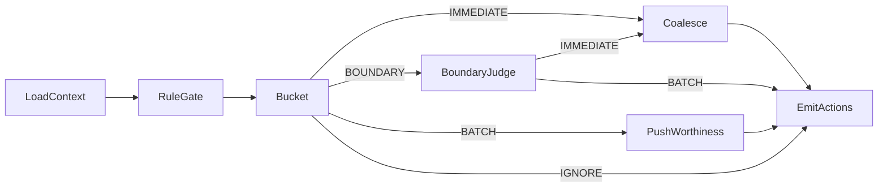

# AI LangGraph Design

Goal: map the current Node Pipeline agent runtime into a LangGraph graph while preserving behavior.

## Mapping from current pipeline

Current nodes:

- LoadContextNode
- RuleGateNode
- BucketNode
- BoundaryJudgeNode
- PushWorthinessNode
- CoalesceNode
- EmitActionsNode

LangGraph approach:

- Each node becomes a LangGraph node with explicit input and output state.
- Node ordering and short circuit behavior are preserved.
- Tool registry remains, but tool execution is hosted by ai-service.

## Graph overview (logical)



## State schema (core)

All fields are stored in ai-service and written to agent_runs and agent_action_ledger.

```json
{
  "run_id": "uuid",
  "goal_id": "uuid",
  "item_id": "uuid",
  "match_score": 0.0,
  "match_features": {},
  "trigger": "IMMEDIATE|BATCH|DIGEST",
  "budget_snapshot": {},
  "decision": "IMMEDIATE|BATCH|DIGEST|IGNORE",
  "reason": {},
  "actions": []
}
```

## Node responsibilities

- LoadContext: fetch goal, item, budget, and history context.
- RuleGate: apply blocked sources, negative terms, strict mode.
- Bucket: threshold based routing.
- BoundaryJudge: LLM decision for borderline cases.
- PushWorthiness: LLM decision for batch or digest evaluation.
- Coalesce: immediate buffer logic (5 minute window).
- EmitActions: emit decision and delivery actions.

## Tool registry policy

- Read tools allowed by default.
- Write tools are restricted and recorded.
- All tool calls are logged in agent_tool_calls.

## Failure and fallback behavior

- LLM failures fall back to conservative decisions.
- Budget disabled flags skip LLM calls.
- Node failures terminate the run with a safe decision.

## Integration with worker-service

Input to ai-service:

- match.computed event or /internal/agent/run request

Output from ai-service:

- agent.decision.completed event with actions array

## Prompt and schema management

- Reuse prompts in prompts/ with versioned paths.
- JSON schema validation is mandatory for all LLM outputs.

## Observability

- agent_runs: summary, status, latency, model used
- agent_tool_calls: tool input and output
- agent_action_ledger: actions emitted for replay
